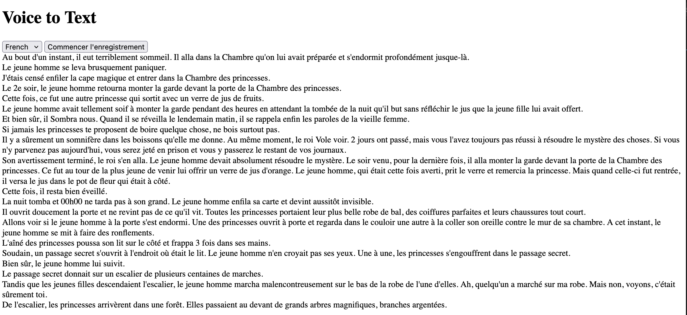

# Real time transcription using Azure Speech / Web Socket

## Prerequisites

- Gstreamer

https://learn.microsoft.com/en-us/azure/ai-services/speech-service/how-to-use-codec-compressed-audio-input-streams?tabs=linux%2Cdebian%2Cjava-android%2Cterminal&pivots=programming-language-python

- Copy .env.template into a new file called .env with the following values filled-in :

```bash
AZURE_SPEECH_REGION = "REGION"
AZURE_SPEECH_KEY = "key"
AZURE_SPEECH_PRIVATE_ENDPOINT = "https://REGION.api.cognitive.microsoft.com/"
```

## Run 

```bash
fastapi run voice_streamed.py
```




